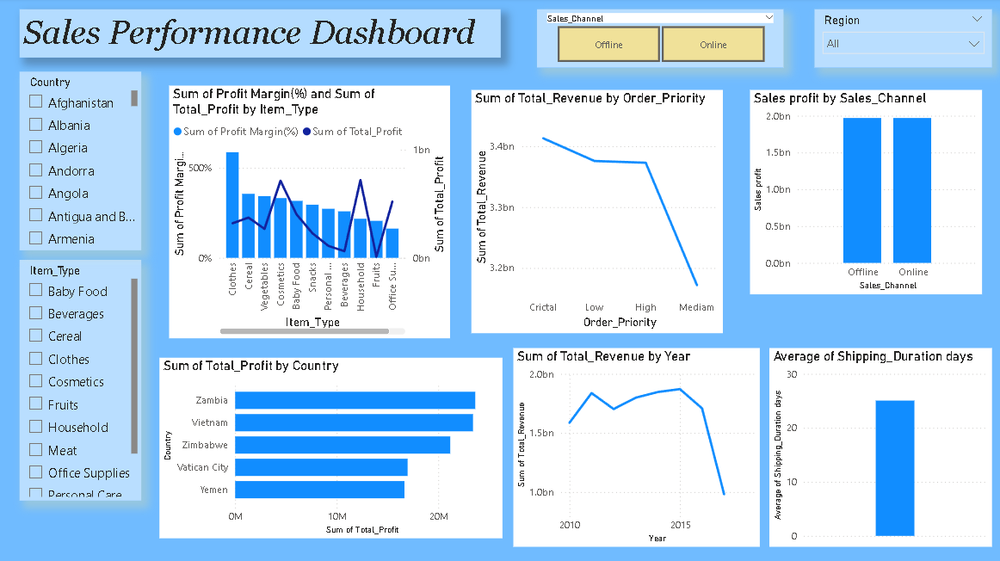

# End-to-End-Sales-Data-Analytics-Pipeline-Excel-MySQL-Power-BI-

This project demonstrates a complete data workflow: cleaning sales data in Excel, loading it into MySQL, and visualizing insights using Power BI. The dashboard highlights key metrics such as revenue, profit, order priority trends, item-type performance, shipping duration, and country-wise profitability.

## 📊 Dashboard Preview

## 🔄 Workflow Steps
1. Data cleaning & transformation using Excel.
2. Structured loading into MySQL Workbench.
3. Power BI connected via MySQL connector.
4. Interactive visuals & KPI reporting.

